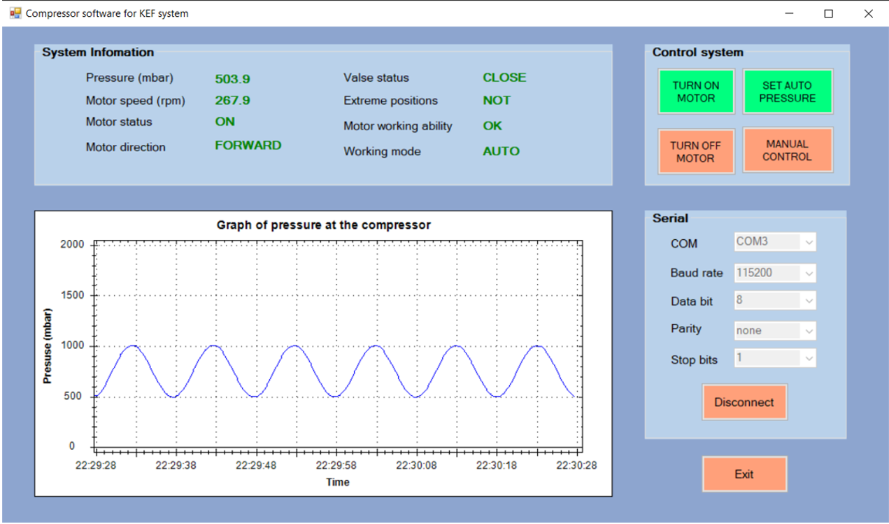

# Control user interface
A program for a computer was developed in the form of a user interface, which was written in C# in the Microsoft Visual Studio environment, allows you to stop the compressor, set the required pressure (constant, linearly changing, meander), display the compressor status, show the pressure for the last 60 seconds in the form waveforms in real time.
